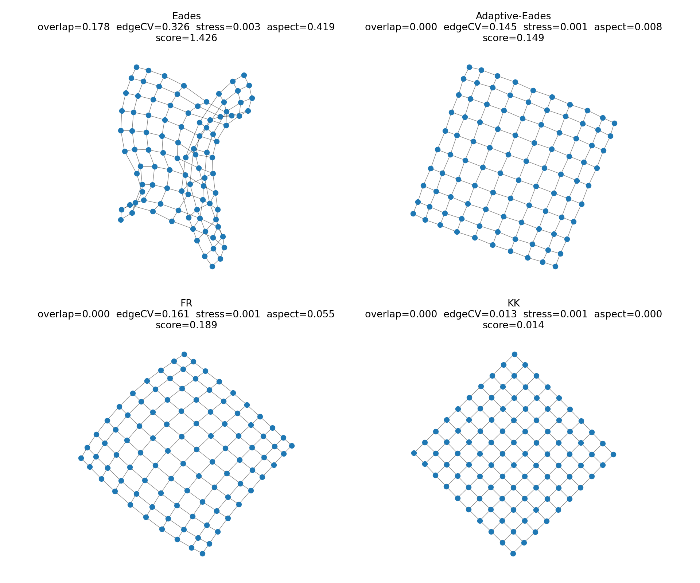
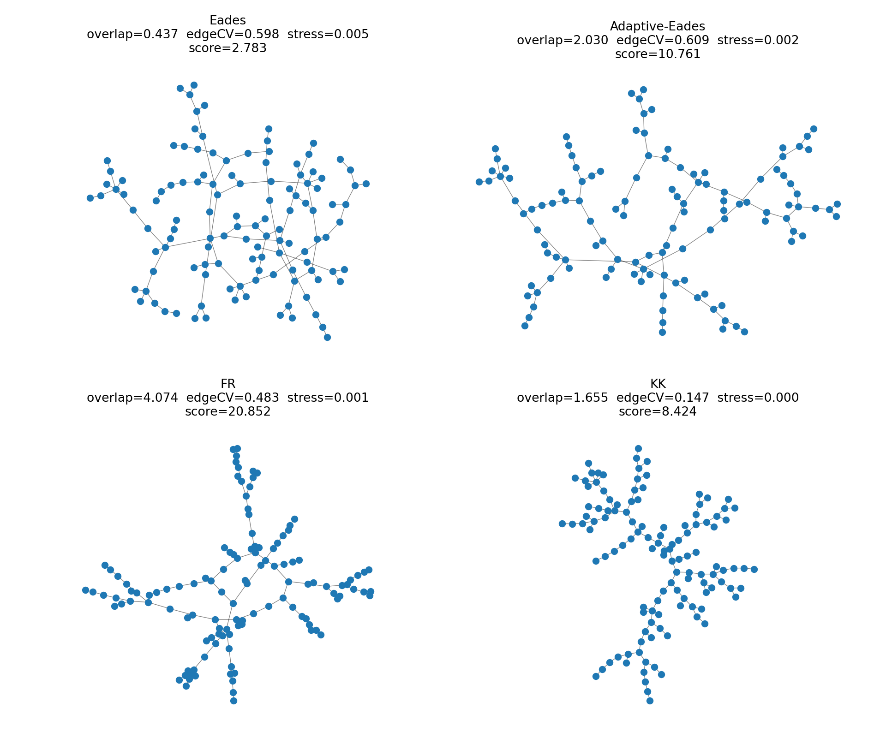
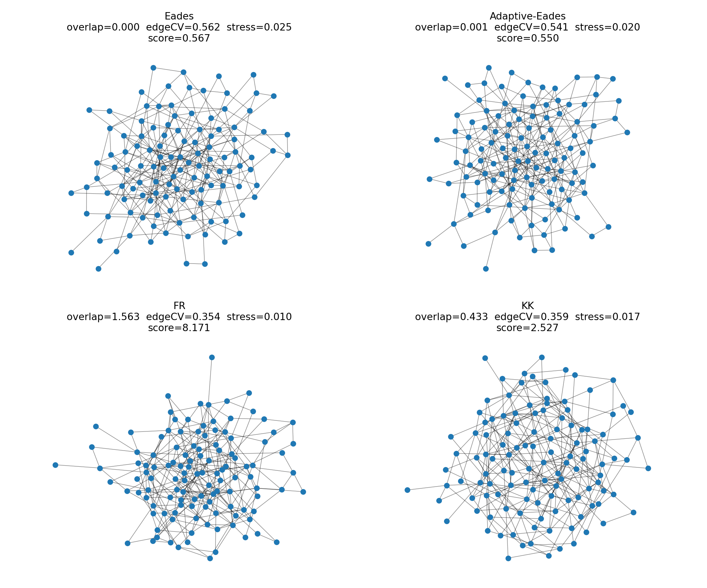
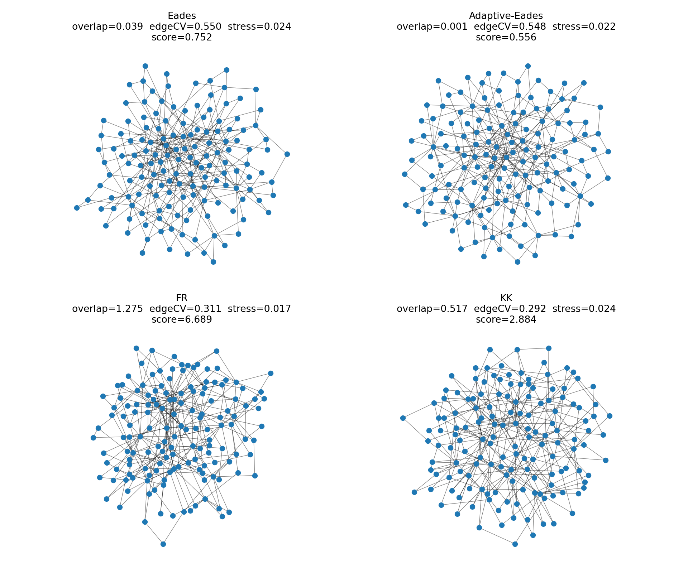
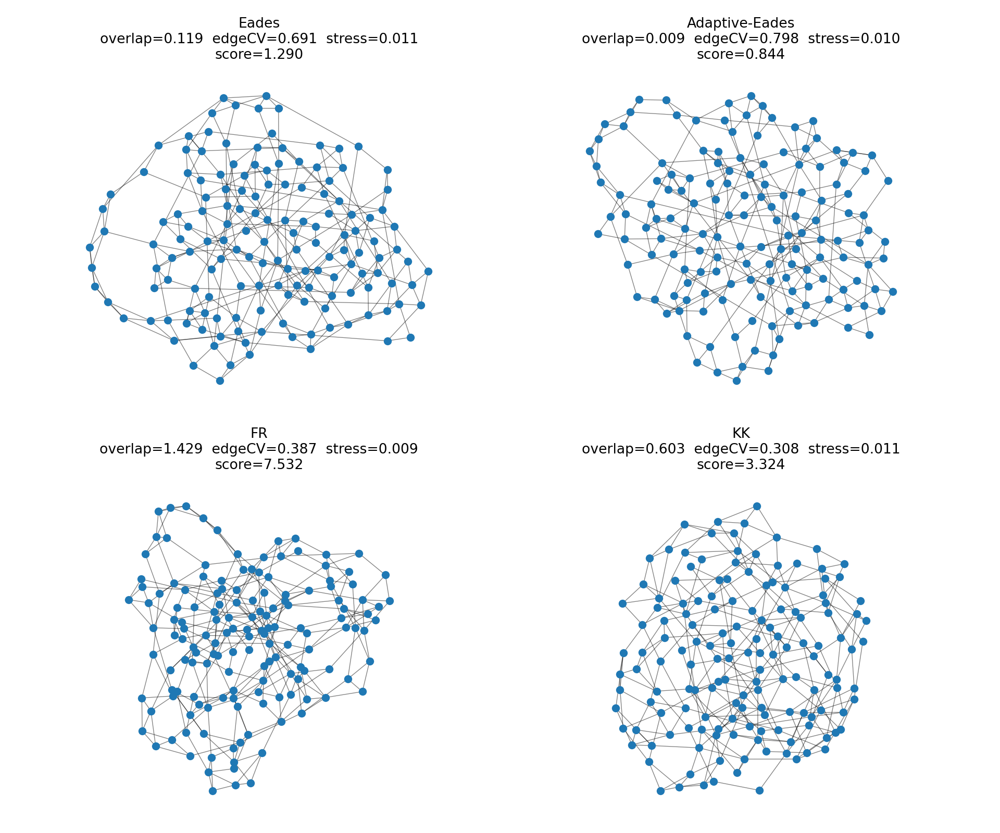
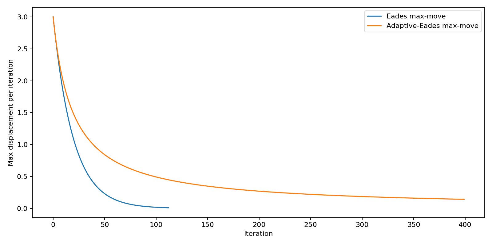

# AUTO_FD Demo

## Overview

This repository contains a small, reproducible comparison of four force-directed graph layout methods, all starting from the same random initial node positions.

### Compared methods

* **Eades** (baseline cooling)
* **Adaptive-Eades** (temperature updated from iteration dynamics)
* **FR** (Fruchterman–Reingold)
* **KK** (Kamada–Kawai)

## Why this demo matters

This demo is designed to show that:

1. **Cooling / step-size control strongly affects Eades outcomes**
2. **Different graph families prefer different force-directed dynamics**
3. This motivates an **algorithm-portfolio + selector/controller** end goal (AutoFD)

---

## Output Files (generated in `out/`)

### A) Panel images (main result)

Pattern: `out/<graph_name>_seed<k>.png`

Each panel is a **2×2 comparison figure**:

* **Top-left:** Eades
* **Top-right:** Adaptive-Eades
* **Bottom-left:** FR
* **Bottom-right:** KK

Each subplot prints these metrics:

* `overlap`
* `edgeCV`
* `stress`
* `score`

### B) Convergence plot (diagnostic)

Pattern: `out/convergence_<graph_name>_seed<k>.png`

This plots **max displacement per iteration** for:

* Eades baseline
* Adaptive-Eades

Useful for showing:

* how quickly the algorithm stabilizes
* whether it oscillates

### C) Summary table (CSV)

File: `out/summary.csv`

One row per **(graph, algorithm)** with columns:

* `graph`
* `seed`
* `algo`
* `overlap`
* `edge_cv`
* `stress`
* `score`

---

## Metrics (short interpretation)

### `overlap`

Penalty for node-node overlaps after normalizing the drawing.
**Lower is better.**
Very large overlap usually means the layout collapsed into a blob/line.

### `edgeCV`

Coefficient of variation of edge lengths (`std / mean`).
**Lower is better.**
Lower edgeCV usually means more uniform edge lengths (often visually cleaner).

### `stress`

Sampled distance-preservation error between Euclidean distances in the drawing and shortest-path distances in the graph.
**Lower is better** for distance preservation.

> Note: stress is **not** a pure aesthetic metric by itself (a degenerate layout can still have low stress).

### `score`

A combined score used for quick ranking in this demo:

`score = 5.0 * overlap + 1.0 * edgeCV + 0.2 * stress`

**Lower is better.**
The heavy weight on overlap is intentional (**readability first**).

---

## Results Gallery (Seed 0)

### Main 2×2 comparison panels

#### `grid_10x10_seed0`



#### `tree_120_seed0`



#### `erdos_120_p004_seed0`



#### `ba_150_m2_seed0`



#### `ws_150_k4_p020_seed0`



---

## Convergence Diagnostic (Seed 0)

#### `convergence_grid_10x10_seed0`



---

## Summary Table (Seed 0 quick takeaway)

**Full per-algorithm results:** [`out/summary.csv`](out/summary.csv)

### Best algorithm by score (current run, seed 0)

| Graph            |     Best Algorithm | Best Score (approx.) |
| ---------------- | -----------------: | -------------------: |
| `grid_10x10`     |             **KK** |           **0.0136** |
| `tree_120`       |             **KK** |           **8.4240** |
| `erdos_120_p004` | **Adaptive-Eades** |           **0.5563** |
| `ba_150_m2`      | **Adaptive-Eades** |           **0.5714** |
| `ws_150_k4_p020` |             **KK** |           **3.3242** |

---

## Key Observations from Current Outputs

* **Baseline Eades often collapses** (very high overlap), showing strong sensitivity to step-size/cooling.
* **Adaptive-Eades can dramatically improve results** on some graph families (e.g., ER, BA), but can still fail on others (e.g., WS in this run).
* **FR and KK are stable reference baselines**, and are sometimes the best choice depending on graph structure.

This directly supports the motivation for an **algorithm-selection / controller** approach.

---

## Recommended Meeting Walkthrough (what to show)

1. **`grid_10x10_seed0.png`**
   Structured graph; differences are easy to explain visually.

2. **`ba_150_m2_seed0.png`** *or* **`erdos_120_p004_seed0.png`**
   Good examples where **Adaptive-Eades** can shine.

3. **`ws_150_k4_p020_seed0.png`** *(optional “hard case”)*
   Useful for motivating **selection / robust control**, not one fixed algorithm.

4. **`convergence_grid_10x10_seed0.png`**
   Shows how **adaptive cooling changes the dynamics** (stabilization / oscillation behavior).

---

## Proposed End Goal (Research Direction)

### AutoFD: Automatic Force-Directed Controller / Selector

Given a graph `G` (and optionally a short probe run from a random initial layout), automatically choose:

* **which force-directed algorithm to run** (Eades vs FR vs KK vs future additions), and/or
* the **best parameter preset / temperature schedule**

to produce an aesthetically readable layout under a fixed time/iteration budget.

### Planned steps

* **Step 1 (Robustness):** Make Eades variants stable across graph families
  (e.g., movement capping per iteration, scale-invariant ideal length).
* **Step 2 (Portfolio):** Treat FR, KK, and Eades variants as a small algorithm portfolio.
* **Step 3 (Selection):** Learn a lightweight selector/controller using graph features + early-iteration signals
  (forces, displacement trends, convergence slope).
* **Step 4 (Evaluation):** Benchmark across diverse graph families, report both quality metrics and runtime budget, and show that automatic selection beats any single fixed method on average.

---

## How to Re-run

Run the demo script from the project folder using your Python environment.
The script will regenerate:

* all panel images in `out/`
* convergence plots in `out/`
* `out/summary.csv`

Example (adjust if your entry script name differs):

```bash
python demo_layouts
```
